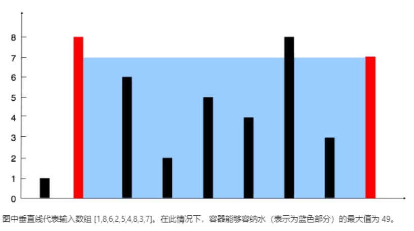

# 11 盛最多水的容器

>问题概述

```zh-cn
 * 给定 n 个非负整数 a1，a2，...，an，每个数代表坐标中的一个点 (i, ai) 。在坐标内画 n 条垂直线，垂直线 i 的两个端点分别为
 * (i, ai) 和 (i, 0)。找出其中的两条线，使得它们与 x 轴共同构成的容器可以容纳最多的水。
 *
 * 说明：你不能倾斜容器，且 n 的值至少为 2。
```

>示例



```zh-cn
 * 示例:
 *
 * 输入: [1,8,6,2,5,4,8,3,7]
 * 输出: 49
```

>方法概述

通过使用双指针的方法，来确定两边最高的两个边即可

>需求分析

1. 需要找到两个两边最长的两个边
2. 通过比较不断与之对比

>整体思路

1. 定义左指针`l`,右指针`r`,以及面积`area`.

2. 只要`右指针`一直大于`左指针`就可一直循环

3. 只需每次用`max(min(heigth[l],heigth[r])*r-1,area)`相比较，即可通过循环找出最大的那个面积

4. 如果两边其中一边的边长相比较小的，则相对小的边的指针向前/后移动一格

>代码

```java
class Solution {
    public int maxArea(int[] height) {
        int l=0,r=height.length-1;
        int area=0;
       while (r>l) {
            area=Math.max(area,(Math.min(height[l], height[r])*(r-l)));
            if (height[r]>height[l]) {
                l++;
            }else{
                r--;
            }
        }
        return area;
    }
}
```
