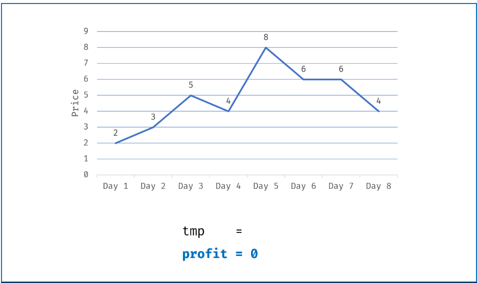
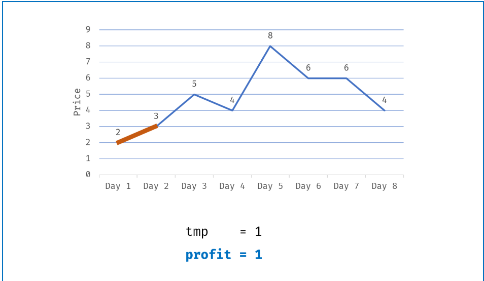
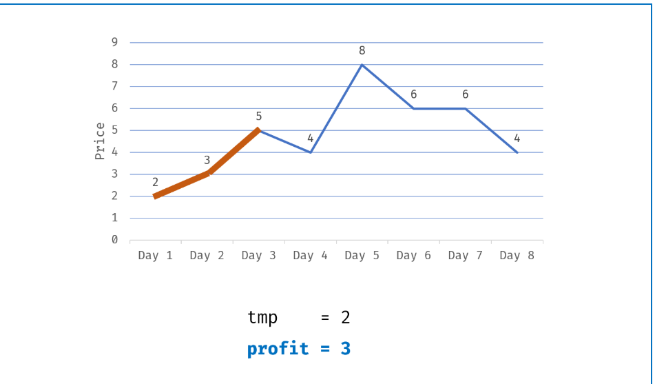
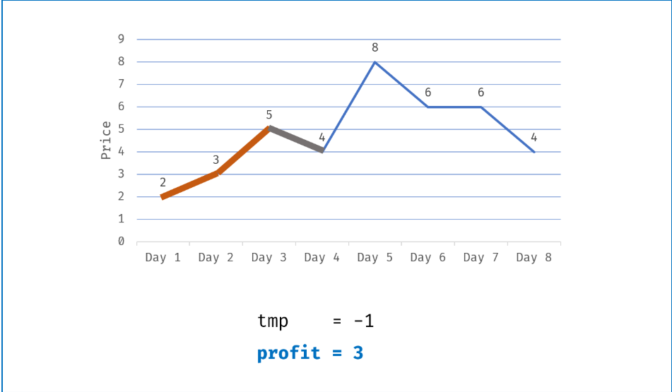

# 买卖股票的最佳时机系列

## 买卖Ⅰ

>题目描述

```zh-cn
 * 给定一个数组，它的第 i 个元素是一支给定股票第 i 天的价格。
 *
 * 如果你最多只允许完成一笔交易（即买入和卖出一支股票），设计一个算法来计算你所能获取的最大利润。
 *
 * 注意你不能在买入股票前卖出股票。
```

>示例

```zh-cn
 * 示例 1:
 *
 * 输入: [7,1,5,3,6,4]
 * 输出: 5
 * 解释: 在第 2 天（股票价格 = 1）的时候买入，在第 5 天（股票价格 = 6）的时候卖出，最大利润 = 6-1 = 5 。
 * ⁠ 注意利润不能是 7-1 = 6, 因为卖出价格需要大于买入价格。
 *
 *
 * 示例 2:
 *
 * 输入: [7,6,4,3,1]
 * 输出: 0
 * 解释: 在这种情况下, 没有交易完成, 所以最大利润为 0。
```

>方法概述

我们可以通过一次遍历，不断的找出最小的，并且通过与这个过程中找到的最大利润的相比较，来完成最大利润的获得

>需求分析

1. 我们需要不断地比较出最小的那个股票价格，可通过包装类 Math.min(min,prices[i])

2. 同样也需要不断找出最大利润， 也可通过包装类 Math.max(max,prices[i]-min)

>整体思路

1. 通过一遍循环

2. 找出其中最小的元素，与当时最大的进行不断的相减，找出利润最大的值

>代码

```java
class Solution {
    public int maxProfit(int[] prices) {
        int max =0;
        int min=prices[0];
        for (int i = 1; i < prices.length; i++) {
            min=Math.min(min, prices[i]);
            max=Math.max(max, prices[i]-min);
        }
        return max;
    }
}

```

## 买卖Ⅱ

>问题描述

```zh-cn
 * 给定一个数组，它的第 i 个元素是一支给定股票第 i 天的价格。
 *
 * 设计一个算法来计算你所能获取的最大利润。你可以尽可能地完成更多的交易（多次买卖一支股票）。
 *
 * 注意：你不能同时参与多笔交易（你必须在再次购买前出售掉之前的股票）。
```

>示例

```zh-cn
 * 输入: [7,1,5,3,6,4]
 * 输出: 7
 * 解释: 在第 2 天（股票价格 = 1）的时候买入，在第 3 天（股票价格 = 5）的时候卖出, 这笔交易所能获得利润 = 5-1 = 4 。
 * 随后，在第 4 天（股票价格 = 3）的时候买入，在第 5 天（股票价格 = 6）的时候卖出, 这笔交易所能获得利润 = 6-3 = 3 。
 *
 *
 * 示例 2:
 *
 * 输入: [1,2,3,4,5]
 * 输出: 4
 * 解释: 在第 1 天（股票价格 = 1）的时候买入，在第 5 天 （股票价格 = 5）的时候卖出, 这笔交易所能获得利润 = 5-1 = 4
 * 。
 * 注意你不能在第 1 天和第 2 天接连购买股票，之后再将它们卖出。
 * 因为这样属于同时参与了多笔交易，你必须在再次购买前出售掉之前的股票。
```

>方法概述

需要我们找到多组最大利润，也就是贪心法，找出局部最优，从而找到整体最优

我们可以将其看作是每天交易，如果这场交易是亏损或者是不赚钱，可以不计入利润

>需求分析

1. 需要我们找到多组交易，我们就看看成每天交易

2. 最后返回的是最大的利润

>整体思路

1. 通过遍历，所有上涨的交易都买卖，所有下降的交易日都不买卖

2. 判断 是否会亏损 temp = prices[i]-prices[i-1]

    1. 若不亏损 temp>0 则算进利润里 profit += temp;

    2. 若亏损 temp <=0 则不算进利润里

3. 返回利润 profit

可看图






即：每次谷底买入，峰顶卖出。

>代码

```java
class Solution {
    public int maxProfit(int[] prices) {
        int temp=0,profit=0;
        for (int i = 1; i < prices.length; i++) {
            temp = prices[i]-prices[i-1];
            if (temp>0) {
                profit+=temp;
            }
        }
        return profit;
    }
}
```

## 买卖三

>问题概述

```zh-cn
 * 给定一个数组，它的第 i 个元素是一支给定的股票在第 i 天的价格。
 *
 * 设计一个算法来计算你所能获取的最大利润。你最多可以完成 两笔 交易。
 *
 * 注意: 你不能同时参与多笔交易（你必须在再次购买前出售掉之前的股票）。
```

>示例

```zh-cn
 * 示例 1:
 *
 * 输入: [3,3,5,0,0,3,1,4]
 * 输出: 6
 * 解释: 在第 4 天（股票价格 = 0）的时候买入，在第 6 天（股票价格 = 3）的时候卖出，这笔交易所能获得利润 = 3-0 = 3 。
 * 随后，在第 7 天（股票价格 = 1）的时候买入，在第 8 天 （股票价格 = 4）的时候卖出，这笔交易所能获得利润 = 4-1 = 3 。
 *
 * 示例 2:
 *
 * 输入: [1,2,3,4,5]
 * 输出: 4
 * 解释: 在第 1 天（股票价格 = 1）的时候买入，在第 5 天 （股票价格 = 5）的时候卖出, 这笔交易所能获得利润 = 5-1 = 4
 *
 * 注意你不能在第 1 天和第 2 天接连购买股票，之后再将它们卖出。
 * 因为这样属于同时参与了多笔交易，你必须在再次购买前出售掉之前的股票。
```

>方法概述

通过状态机的方式

>以循环来实现次数的改变

```java
int max_k = 2;
int[][][] dp = new int[n][max_k + 1][2];
for (int i = 0; i < n; i++) {
    for (int k = max_k; k >= 1; k--) {
        if (i - 1 == -1) { /*处理 base case */ }
        dp[i][k][0] = max(dp[i-1][k][0], dp[i-1][k][1] + prices[i]);
        dp[i][k][1] = max(dp[i-1][k][1], dp[i-1][k-1][0] - prices[i]);
    }
}
// 穷举了 n × max_k × 2 个状态，正确。
return dp[n - 1][max_k][0];

```

>由于 2 次 次数较少，可直接遍历

```java
int maxProfit_k_2(int[] prices) {
    int dp_i10 = 0, dp_i11 = Integer.MIN_VALUE;
    int dp_i20 = 0, dp_i21 = Integer.MIN_VALUE;
    for (int price : prices) {
        dp_i20 = Math.max(dp_i20, dp_i21 + price);
        dp_i21 = Math.max(dp_i21, dp_i10 - price);
        dp_i10 = Math.max(dp_i10, dp_i11 + price);
        dp_i11 = Math.max(dp_i11, -price);
    }
    return dp_i20;
}

```

## 买卖四

>注意点

1. 由于之前有 k=2 的铺垫，对于任意 K 可以借鉴

2. 由于 K 为任意，所以 k 有可能是 > n 的。这样的话，会出现超时情况

    因为，买卖需要一买一卖，完成一次交易至少需要两天。所以当k>n/2时，是无意义的，只需要将能一直交易的方法再重现一遍

>代码

```java
class Solution {
    public int maxProfit(int k, int[] prices) {
        if(k==0) return 0;
        int n = prices.length;
        if(k>prices.length/2) return profit(prices);
        int[][][] dp = new int[n][k+1][2];
        for(int i=0;i<n;i++){
            // base case
            dp[i][0][0] = 0;//至今为止没有交易，收益为0
            dp[i][0][1] = Integer.MIN_VALUE;//交易了0次，但持有股票，不符合规则
            for(int t =1;t<=k;t++){
                // base case
                if(i==0){
                    dp[i][t][0] = 0;//第一天买入t次，当天卖出t次,收入为0
                    dp[i][t][1] = -prices[i];//甭管第一天买多少次，反正最后少卖一次，持有了股票
                    continue;
                }
                dp[i][t][0] = Math.max(dp[i-1][t][0],dp[i-1][t][1]+prices[i]);
                dp[i][t][1] = Math.max(dp[i-1][t][1], dp[i-1][t-1][0]-prices[i]);
            }
        }
        return dp[n-1][k][0];
    }

    private int profit(int[] prices){
        int dp_i_0 = 0;
        int dp_i_1 = Integer.MIN_VALUE;
        int tmp = 0;
        for(int i =0;i<prices.length;i++){
            tmp = dp_i_0;
            dp_i_0 = Math.max(dp_i_0, dp_i_1 + prices[i]);
            dp_i_1 = Math.max(dp_i_1, tmp-prices[i]);
            tmp = dp_i_0;
        }
        return dp_i_0;
    }
}
```
