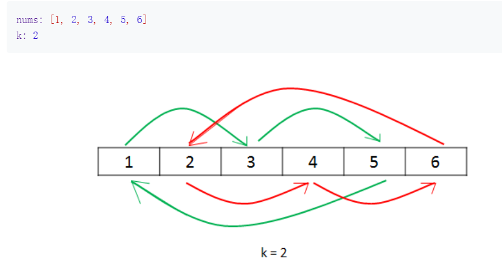

# LeetCode 第二天

## 189 旋转数组

>给定一个数组，将数组中的元素向右移动 k 个位置，其中 k 是非负数。

```zh-cn
    示例 1:

    输入: [1,2,3,4,5,6,7] 和 k = 3
    输出: [5,6,7,1,2,3,4]
    解释:
    向右旋转 1 步: [7,1,2,3,4,5,6]
    向右旋转 2 步: [6,7,1,2,3,4,5]
    向右旋转 3 步: [5,6,7,1,2,3,4]


    示例 2:

    输入: [-1,-100,3,99] 和 k = 2
    输出: [3,99,-1,-100]
    解释:
    向右旋转 1 步: [99,-1,-100,3]
    向右旋转 2 步: [3,99,-1,-100]
```

## 方法  --- 共有三种方法

### 方法一：暴力法

>整体思路：

将元素旋转K次，每个元素都要移动

>代码：

```Java
public class Solution {
    public void rotate(int[] nums, int k) {
        int temp, previous;
        for (int i = 0; i < k; i++) {
            previous = nums[nums.length - 1];
            for (int j = 0; j < nums.length; j++) {
                temp = nums[j];
                nums[j] = previous;
                previous = temp;
            }
        }
    }
}
```

### 方法二：使用环状替换

>整体思路：

1. 将数组想象成一排学生

2. 第一个学生向后移K个位置，第K个位置的同学再向后移动K个位置

3. 到达边界时：k %= nums.length;

4. 依次类推

5. 最后只需要，所有元素移动即可，故加一个 count 变量，来计数

>示意图



>代码

```java
public class Solution {
    public void rotate(int[] nums, int k) {
        k = k % nums.length;
        int count = 0;
        for (int start = 0; count < nums.length; start++) {
            int current = start;
            int prev = nums[start];
            do {
                int next = (current + k) % nums.length;
                int temp = nums[next];
                nums[next] = prev;
                prev = temp;
                current = next;
                count++;
            } while (start != current);
        }
    }
}
````

### 方法三：反转法

>整体思路：

每次旋转会有 k%nums.length 个尾部元素移动到头部，剩下的元素会向后移动。

>在这个方法中，我们可以:

1. 先将所有元素反转
2. 再将前k个元素进行反转
3. 最后将 n-k 个元素反转

>k=3

- 原始数组：              1 2 3 4 5 6
- 反转所有数组后：        6 5 4 3 2 1
- 反转前k个元素：         4 5 6 3 2 1
- 反转n-k个元素：         4 5 6 1 2 3

>代码：

```java
    public class Solution {
    public void rotate(int[] nums, int k) {
        k %= nums.length;
        reverse(nums, 0, nums.length - 1);
        reverse(nums, 0, k - 1);
        reverse(nums, k, nums.length - 1);
    }
    public void reverse(int[] nums, int start, int end) {
        while (start < end) {
            int temp = nums[start];
            nums[start] = nums[end];
            nums[end] = temp;
            start++;
            end--;
        }
    }
}
```
