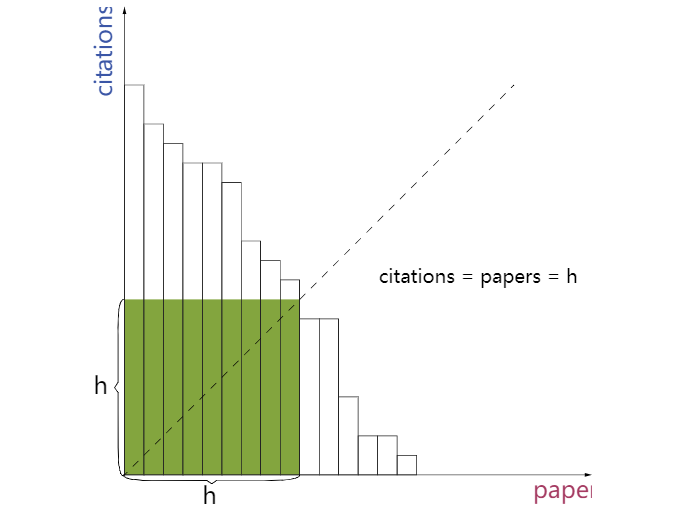

# 274 H指数

>给定一位研究者论文被引用次数的数组（被引用次数是非负整数）。编写一个方法，计算出研究者的 h 指数。

>h 指数的定义: “h 代表“高引用次数”（high citations），一名科研人员的 h 指数是指他（她）的 （N 篇论文中）至多有 h篇论文分别被引用了至少 h 次。（其余的 N - h 篇论文每篇被引用次数不多于 h 次。)。

## 示例

    输入: citations = [3,0,6,1,5]
    输出: 3 
    解释: 给定数组表示研究者总共有 5 篇论文，每篇论文相应的被引用了 3, 0, 6, 1, 5 次。
    由于研究者有 3 篇论文每篇至少被引用了 3 次，其余两篇论文每篇被引用不多于 3 次，所以她的 h 指数是 3。

>需求分析

    1. 需要找到找到文章数和引用数均为 h 的一个数

>即



    X轴代表文章，Y轴代表每篇文章的引用次数

    如果将这些文章按照降序表示，那么直方图上最大正方形的边长 H 就是我们所要求的 H

>整体思路

    1. 对引用次数降序排序，如果 citations[i]>i 那么说明 0-i 篇论文至少有 i+1 次引用。

    2.因此，我们只要找到最大满足的 i 满足 citations[i]>i  那么 h 的指数为 i+1

>代码

```java

class Solution {
    public int hIndex(int[] citations) {
        Arrays.sort(citations);
        int h=0;
        while (h<citations.length&&citations[citations.length-1-h]>h) {
            h++;
        }
        return h;
    }
}

```