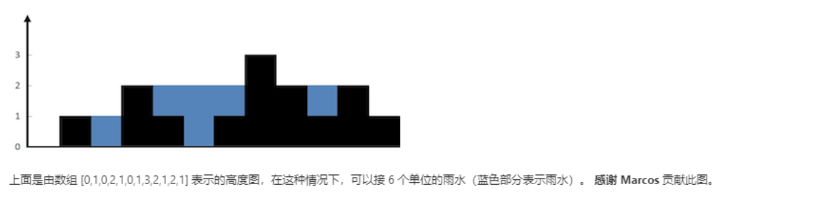
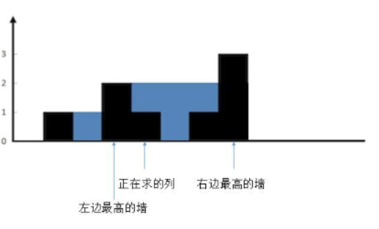
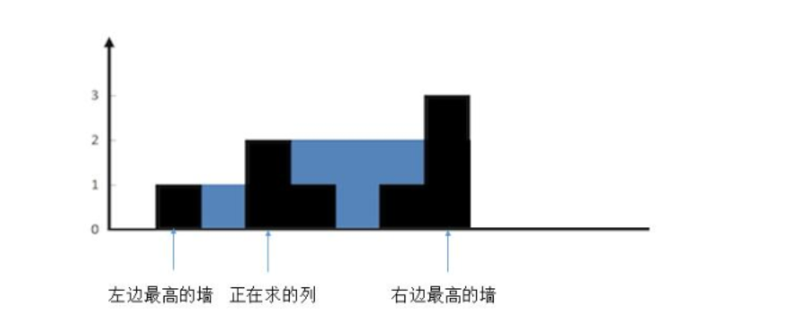
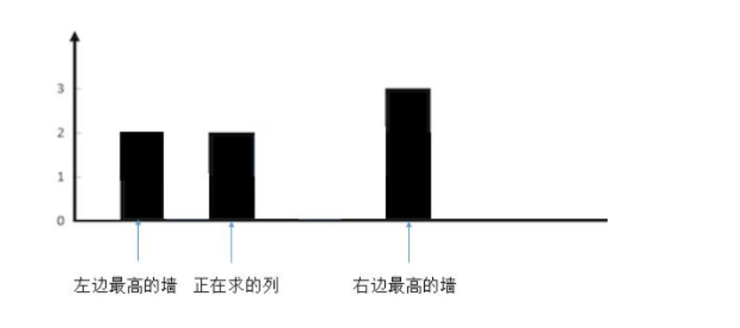

# 42 接雨水

>题目描述

```zh-cn
* 给定 n 个非负整数表示每个宽度为 1 的柱子的高度图，计算按此排列的柱子，下雨之后能接多少雨水。
```



>示例

```zh-cn
 * 示例:
 *
 * 输入: [0,1,0,2,1,0,1,3,2,1,2,1]
 * 输出: 6
```

## 方法一：按列找水

>方法概述

求每一列的水，我们只需要关注`当前列`，`左边最高的墙`，`右边最高的墙`

根据木桶效应，我们只需要找出三者中最矮的是哪个

根据以上描述有三种状态

根据这三种状态，我们只需要关注`当前求的列头上是否有水`

1. 两道墙中较矮的那道墙大于当前列的墙的的高度



这种情况有当前列是有水的，所求的水=`两边较矮的那个墙的高度 - 当前列的高度` 也就是 `2-1=1`
2. 两边的墙中，有一道墙会矮于当前所求的墙



这种情况下，当前墙的头上是没有水的
3. 两边的墙中，有一道墙等于当前求的墙的高度



这种情况下，当前墙头上也是没有水的

总结：

这三种情况中，只有第一种情况是当前墙是有水的

>代码

```java
public int trap(int[] height) {
    int sum = 0;
    //最两端的列不用考虑，因为一定不会有水。所以下标从 1 到 length - 2
    for (int i = 1; i < height.length - 1; i++) {
        int max_left = 0;
        //找出左边最高
        for (int j = i - 1; j >= 0; j--) {
            if (height[j] > max_left) {
                max_left = height[j];
            }
        }
        int max_right = 0;
        //找出右边最高
        for (int j = i + 1; j < height.length; j++) {
            if (height[j] > max_right) {
                max_right = height[j];
            }
        }
        //找出两端较小的
        int min = Math.min(max_left, max_right);
        //只有较小的一段大于当前列的高度才会有水，其他情况不会有水
        if (min > height[i]) {
            sum = sum + (min - height[i]);
        }
    }
    return sum;
}
```

## 方法二：动态规划

>方法概述

我们注意到，我们每次查到当前列时，每次都要遍历一边数组来获得最大的一边

我们可以优化一下，分别用两个数组来存储当前列的两边墙的最大值
这样，只需要循环`2n`遍即可

>整体思路

1. 定义两个数组`max_left[]`,`max_right[]`用来存放第`i`个当前列中的两边最高的墙

2. 通过两个循环来时的两个数组记录当前墙两边的最高的墙

3. 通过循环和两边数组判断当前墙上是否有水

>代码

```java
class Solution {
    public int trap(int[] height) {
        int sum=0;
        int[] max_left=new int[height.length];
        int[] max_right=new int[height.length];
        for (int i = 1; i < max_right.length-1; i++) {
            max_left[i]=Math.max(max_left[i-1], height[i-1]);
        }
        for (int j = height.length-2; j>=0; j--) {
            max_right[j]=Math.max(max_right[j+1], height[j+1]);
        }
        for (int i = 1; i < max_right.length-1; i++) {
            int min = Math.min(max_left[i], max_right[i]);
            if (min>height[i]) {
                sum=sum+(min-height[i]);
            }
        }
        return sum;
    }
}
```

## 方法三:双指针

>方法概述

通过上面的方法，我们明白，每次两边墙的数组中的元素其实只用了一次，之后再也用不到了，所以我们可以用变量来代替数组

优化动态规划的方法，将动态规划中以空间换时间中的空间更进一步的优化

我们可以用两个变量`max_left`与`max_right`来代替两个数组，通过判断两个当前变量的大小，小的那个墙与当前墙判断大小，之后就又适用于动态规划中的三种情况

>需求分析

1. 需要两个变量来记录最左边的和最右边的墙

2. 需要判断这两个变量的大小

3. 判断完两个变量的大小，小的那个与当前墙进行比较`三种情况`进行参考

4. 小的那个可以继续前进/后退

>整体思路

着重分析循环内部

1. 因为有n个元素，所以循环`n`遍

2. 分两种情况

    1. 如果`height[left-1]`< `heitht[right+1]`，则进入条件，判断当前墙的高度高还是`heitht[left-1]`高，如果当前墙矮的话，就符合动态规划中增加雨水的情况。

    2. `right`同理。

3. 判断完毕可以将`left`/`right` ++/--

>代码

```java
public int trap(int[] height) {
    int sum = 0;
    int max_left = 0;
    int max_right = 0;
    int left = 1;
    int right = height.length - 2; // 加右指针进去
    for (int i = 1; i < height.length - 1; i++) {
        //从左到右更
        if (height[left - 1] < height[right + 1]) {
            max_left = Math.max(max_left, height[left - 1]);
            int min = max_left;
            if (min > height[left]) {
                sum = sum + (min - height[left]);
            }
            left++;
        //从右到左更
        } else {
            max_right = Math.max(max_right, height[right + 1]);
            int min = max_right;
            if (min > height[right]) {
                sum = sum + (min - height[right]);
            }
            right--;
        }
    }
    return sum;
}
```