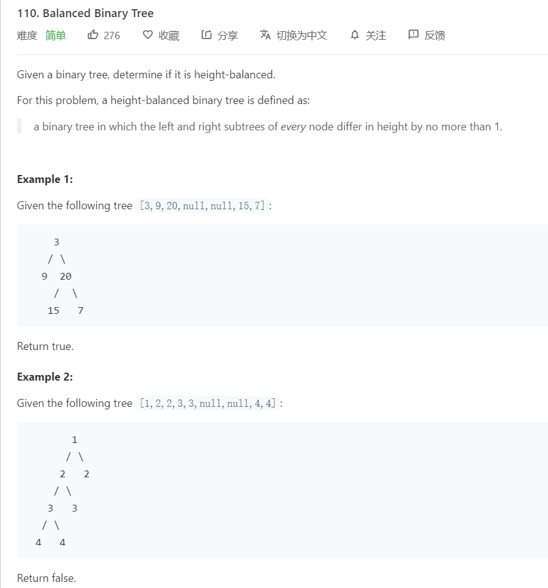

# 110 Balanced Binary Tree
## 题目

## 解法


### 代码

```java
//自顶向下 暴力递归
class Solution {
    public boolean isBalanced(TreeNode root) {
        if(root==null) return true;
        int leftDepth = getDepth(root.left);
        int rightDepth = getDepth(root.right);
        if(Math.abs(leftDepth-rightDepth)>=2){
            return false;
        }
        return isBalanced(root.left)&&isBalanced(root.right);
    }
    public int getDepth(TreeNode root){
        if(root==null) return 0;
        int left = getDepth(root.left);
        int right=getDepth(root.right);
        return Math.max(left,right)+1;
    }
}
```
```java
//自底向上 剪枝
class Solution {
    public boolean isBalanced(TreeNode root) {

        return getDepth(root)!=-1;
    }
    public int getDepth(TreeNode root){
        if(root==null) return 0;

        int left = getDepth(root.left);
        if(left==-1) return -1;
        int right=getDepth(root.right);
        if(right==-1) return -1;
        if(Math.abs(left-right)>=2)
        return -1;
        return Math.max(left,right)+1;
    }
}
```
