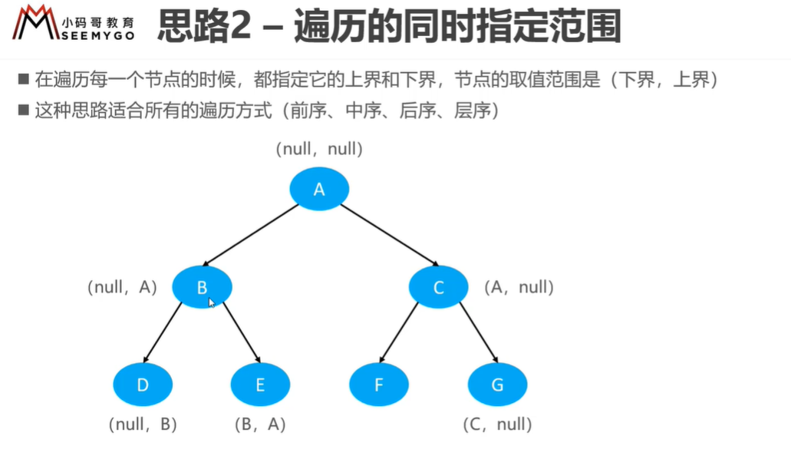

# 98  验证二叉搜索树
## 解法
### 中序遍历递归
#### 代码
```java
//中序遍历递归
class Solution {
    Integer last=null;
    public boolean isValidBST(TreeNode root) {
        if(root==null) return true;
        if(!isValidBST(root.left)) return false;
        if(last!=null&&root.val<=last) return false;
        last=root.val;
        if(!isValidBST(root.right)) return false;
        return true;
    }
}
```
### 中序遍历迭代
#### 代码
```java
//中序遍历迭代
class Solution {
     Integer last = Integer.MAX_VALUE;
    public boolean isValidBST(TreeNode root) {
        if(root==null) return true;
        Deque<TreeNode> stack = new LinkedList<>();
        
        while(!stack.isEmpty()||root!=null){
            while(root!=null){
                stack.push(root);
                root=root.left;
            }
            root = stack.pop();
            if(root.val <= last) return false;
            last=root.val;
            root=root.right;
        }
        return true;
    }
}
```
### 通用法-设定范围法
#### 代码

```java
//前序递归设定范围

class Solution {

    public boolean isValidBST(TreeNode root) {
        return helper(root,Long.MIN_VALUE,Long.MAX_VALUE);
    }
    public boolean helper(TreeNode root,long lower,long upper){
        if(root==null) return true;
        if(root.val<=lower) return false;
        if(root.val>=upper) return false;
        if(!helper(root.left,lower,root.val)) return false;
        if(!helper(root.right,root.val,upper)) return false;
        return true;
    } 
}
```