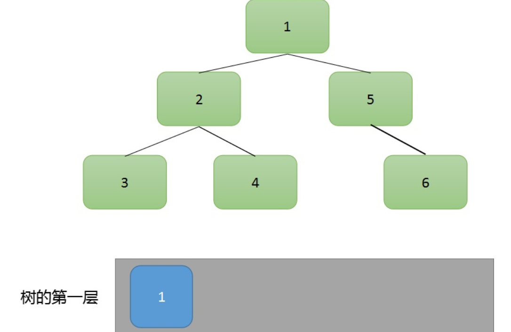
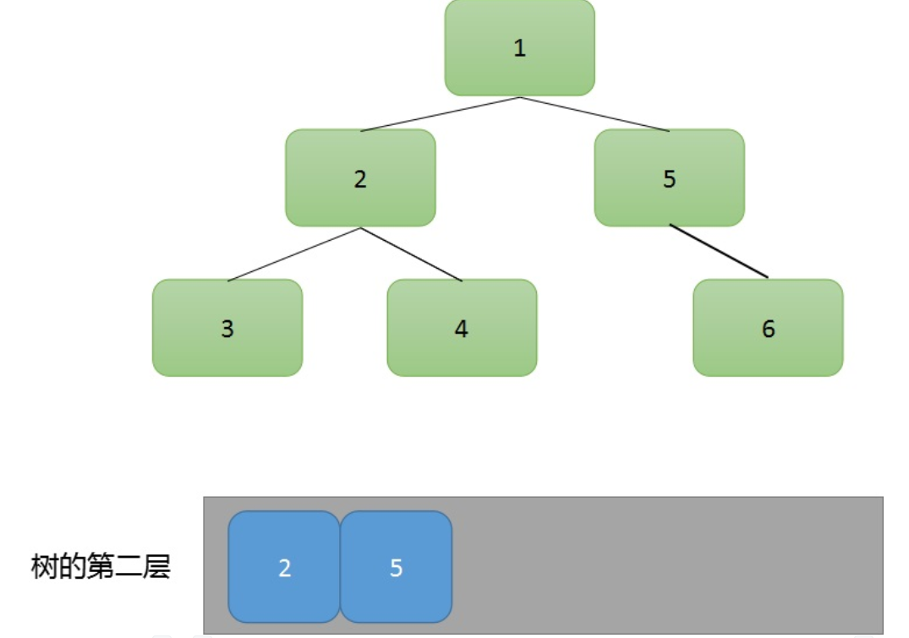
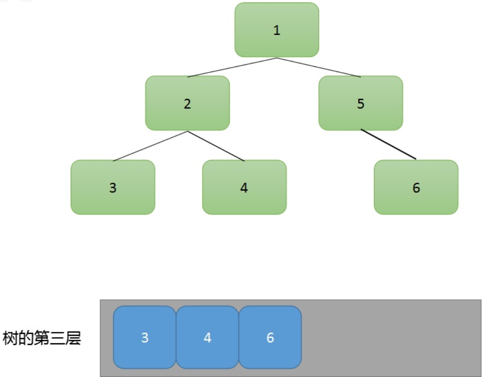

# 二叉树层序遍历(BFS迭代、DFS递归)方法-JAVA
## 题目描述
    我想应该不用过多解释，就是将二叉树每一层所有节点遍历出来。
## 题目解法
### 1.BFS迭代
#### 主要思路
1. 我们用一个`队列`来存储`每一层的所有节点`。
2. 通过对每个节点进行`出队`的同时，将每个节点的`左子树和右子树`加入到队列中。
3. 通过这样的循环来对二叉树进行层序遍历



#### 代码
```java
class Solution {
    public List<List<Integer>> levelOrder(TreeNode root) {
        Deque<TreeNode> quque = new LinkedList<>();//用来存储
        List<List<Integer>> res = new ArrayList<>();//用来存储最终结果
        if(root==null)return res;//判断特殊情况
        int lever =0;
        quque.add(root);
        while(!quque.isEmpty()){
            //每一层都建立新的数组来存放每一层的结果
            res.add(new ArrayList<Integer>());
            int lenth = quque.size();
            //每一层节点有多少个，就循环多少遍
            for(int i =0;i<lenth;++i){
                //出栈的同时将节点记录
                TreeNode node = quque.remove();
        
                res.get(lever).add(node.val);
                if(node.left!=null){
                    quque.add(node.left);
                }
                if(node.right!=null){
                    quque.add(node.right);
                }
            }
            lever++;
        }
        return res;
    }
}

```
### 2.DFS递归
#### 主要思路
1. 主要是利用`DFS`的思想，对一个子树进行不断的递归。
2. 由于我们是层序遍历，所以我们可以通过一个变量`lever`来记录当前是第几层。
3. 利用`lever`来将遍历出来的节点放入相应`lever`的结果中。

#### 代码
```java
class Solution {
    List<List<Integer>> res = new ArrayList<>();
    public List<List<Integer>> levelOrder(TreeNode root) {
        if(root==null)return res;
        dfs(root,0);
        return res;
    }
    public void dfs(TreeNode node,int lever){
        //每层创建新的数组
        if(res.size()==lever)
        res.add(new ArrayList<Integer>());
        
        res.get(lever).add(node.val);

        if(node.left!=null){
            dfs(node.left,lever+1);
        }
        if(node.right!=null){
            dfs(node.right,lever+1);
        }
    }
}
```
