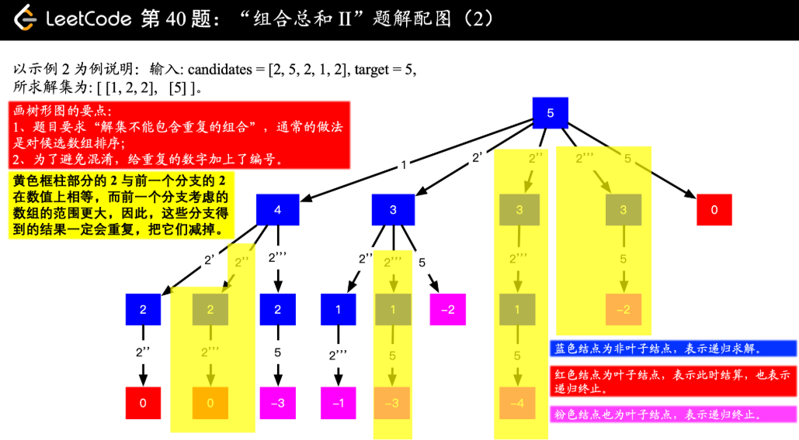

# 40 组合总和
## 解法
### 代码


- 剪枝
    - 去掉重复：黄色框住部分的2与前一分支的2在数值上相等，而前一个分支考虑的范围更大。因此这些分支的结果一定会重复，把他们剪掉。
```java
public class Solution {

    /**
     * @param candidates 候选数组
     * @param len
     * @param begin      从候选数组的 begin 位置开始搜索
     * @param residue    表示剩余，这个值一开始等于 target，基于题目中说明的"所有数字（包括目标数）都是正整数"这个条件
     * @param path       从根结点到叶子结点的路径
     * @param res
     */
    private void dfs(int[] candidates, int len, int begin, int residue, Deque<Integer> path, List<List<Integer>> res) {
        if (residue == 0) {
            res.add(new ArrayList<>(path));
            return;
        }
        for (int i = begin; i < len; i++) {
            // 大剪枝
            if (residue - candidates[i] < 0) {
                break;
            }

            // 小剪枝
            if (i > begin && candidates[i] == candidates[i - 1]) {
                continue;
            }

            path.addLast(candidates[i]);

            // 因为元素不可以重复使用，这里递归传递下去的是 i + 1 而不是 i
            dfs(candidates, len, i + 1, residue - candidates[i], path, res);

            path.removeLast();
        }
    }

    public List<List<Integer>> combinationSum2(int[] candidates, int target) {
        int len = candidates.length;
        List<List<Integer>> res = new ArrayList<>();
        if (len == 0) {
            return res;
        }

        // 先将数组排序，这一步很关键
        Arrays.sort(candidates);

        Deque<Integer> path = new ArrayDeque<>(len);
        dfs(candidates, len, 0, target, path, res);
        return res;
    }
}
```