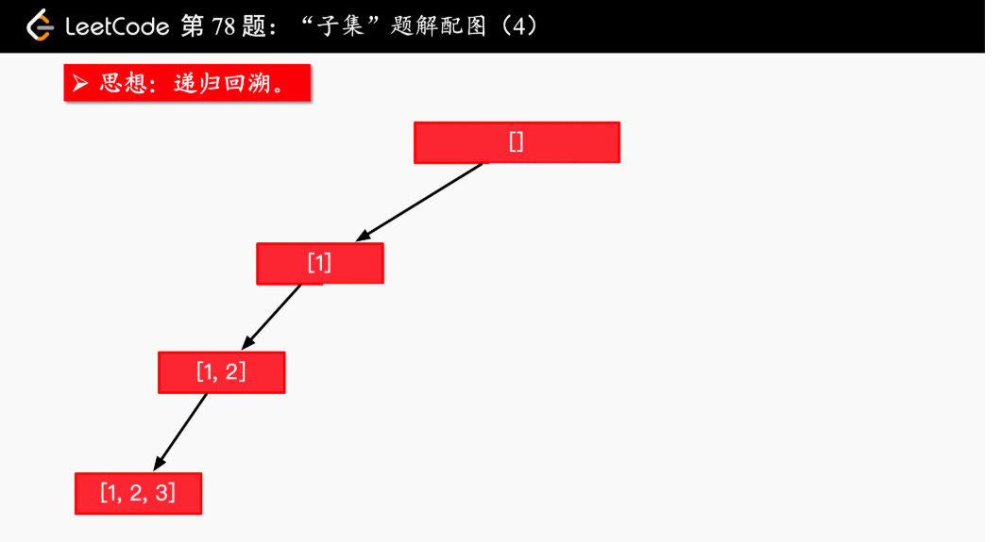
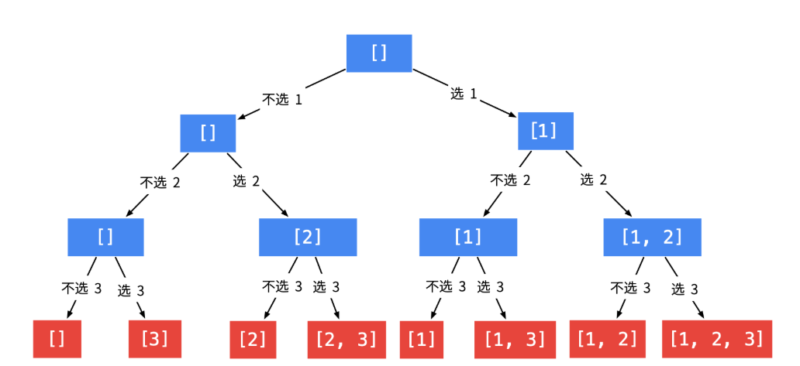

# 78 子集
 ## 解法

### 代码
#### 递归回溯--按节点添加

 ```java
 //递归回溯--按节点添加
class Solution {
    List<List<Integer>> res= new ArrayList<>();
    public List<List<Integer>> subsets(int[] nums) {
        
        List<Integer> list = new ArrayList<>();
        helper(nums,0,list);
        return res;
    }
    public void helper(int[] nums,int index,List<Integer> list){
        res.add(new ArrayList<Integer>(list));
        for(int i=index;i<nums.length;i++){
            list.add(nums[i]);
            helper(nums,i+1,list);
            list.remove(list.size()-1);
        }
    }
}
```
#### 递归回溯2

```java
//递归回溯2
class Solution {
    public List<List<Integer>> subsets(int[] nums) {
        List<List<Integer>> res = new ArrayList<>();
        int len = nums.length;
        if (len == 0) {
            return res;
        }
        Stack<Integer> stack = new Stack<>();
        dfs(nums, 0, len, stack, res);
        return res;
    }

    private void dfs(int[] nums, int index, int len,
                     Stack<Integer> stack, List<List<Integer>> res) {
        if (index == len) {
            res.add(new ArrayList<>(stack));
            return;
        }
        // 当前数可选，也可以不选

        // 不选，直接进入下一层
        dfs(nums, index + 1, len, stack, res);

        // 选了有，进入下一层
        stack.add(nums[index]);
        dfs(nums, index + 1, len, stack, res);
        stack.pop();
    }
}
```
