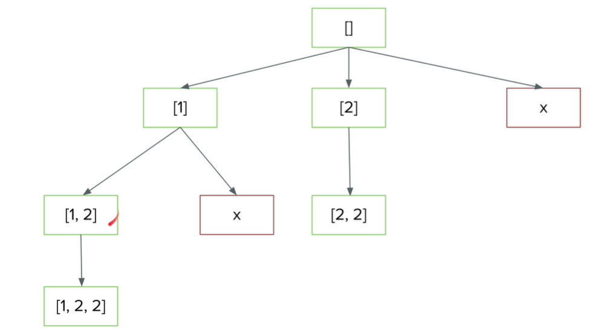
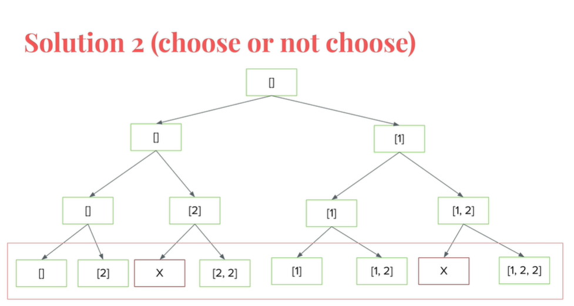

# 90_子集Ⅱ
## 解法
### 代码

```java
//回溯--按节点加入
class Solution {
    List<List<Integer>> res= new ArrayList<>();
    public List<List<Integer>> subsetsWithDup(int[] nums) {
        Arrays.sort(nums);
        List<Integer> list = new ArrayList<>();
        helper(nums,0,list);
        return res;
    }
    public void helper(int[] nums,int index,List<Integer> list){
        res.add(new ArrayList<Integer>(list));
        for(int i=index;i<nums.length;i++){
            //剪枝：排序之后，如果目前的索引指的数与前一个索引指的数相同就跳过。
            if(i>index&&nums[i]==nums[i-1]) continue;
            list.add(nums[i]);
            helper(nums,i+1,list);
            list.remove(list.size()-1);
        }
    }
}
```

```java
//回溯--按选或不选
class Solution {
    List<List<Integer>> res= new LinkedList<>();
    public List<List<Integer>> subsetsWithDup(int[] nums) {
        Arrays.sort(nums);
        Deque<Integer> stack= new LinkedList<>();
        helper(nums,0,stack);
        return res;
    }
    public void helper(int[] nums,int index, Deque<Integer> stack){
        if(index==nums.length){
        res.add(new LinkedList<Integer>(stack));
        return ;
        }
        stack.push(nums[index]);
        helper(nums,index+1,stack);
        stack.pop();
        if(stack.size()>0&&stack.peek()==nums[index]){
        return; 
        }
        helper(nums,index+1,stack);

    }
}
```